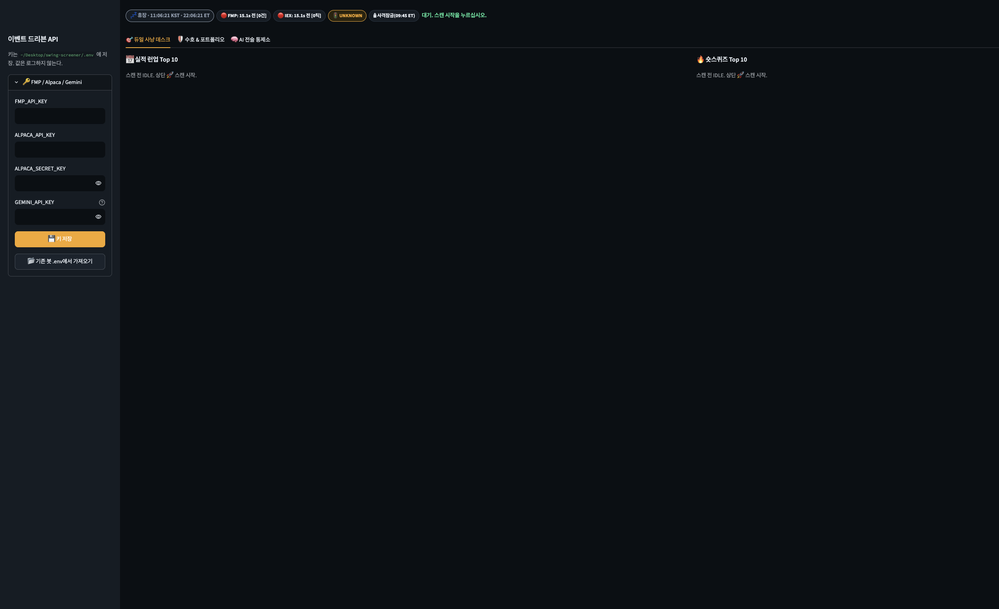

# P0 패치 셀프 테스트 · 검증 보고서

- **대상:** `P0_PATCH_INSTRUCTION.md` / `p0_payload/` (7개 파일 교체 + 테스트 1개 신설)
- **수행일:** 2026-10-03 (KST 11:00 전후, ET 금요일 22:00 전후)
- **환경:** Python 3.13.12, Streamlit 1.64.0, macOS, 프로젝트 `.venv`
- **원칙:** 실전 파일, `.env`, `portfolio.json`, 체결 장부는 건드리지 않음. 키 없는 격리 사본에서만 실행. 외부 API 실호출 0건.

---

## 0. 결론

**판정: 적용 가능.** 패치본은 66개 검사 전부 통과(66/66)했고, 같은 결과가 2회 연속 재현되었다. 같은 시나리오에서 패치 전 원본은 42개 중 12개만 통과했다. 원본은 패치 전용 기능 검사를 건너뛰므로 분모가 작다.

셀프 테스트는 **지시서 자체의 결함 2건**(`screener/portfolio.py`)을 잡아냈다. 둘 다 수정했고, 수정본은 지시서와 `p0_payload/`에 반영했다. 수정 전 지시서를 그대로 적용했다면, 포트폴리오 파일이 손상된 상태에서 **정상 백업까지 파괴**되는 경로가 있었다.

남은 리스크는 7절에 있다. 그중 운용에 직접 영향을 주는 것은 두 가지다. 브라우저 자동재생 정책 때문에 실제 소리가 나려면 페이지를 한 번 클릭해 두어야 하고, 조기 폐장일(반일장)은 아직 모델링되지 않았다.

---

## 1. 검증 방법

1. **격리 사본 2벌.** `.selftest_p0/baseline/`(현재 실전 코드 사본)과 `.selftest_p0/patched/`(같은 사본에 `p0_payload/` 덮어씀)를 만들었다. `diff` 결과, 두 사본의 차이는 의도한 7개 파일과 테스트 1개뿐이다. `.env`는 복사하지 않아 API 키가 없고, 그래서 외부 통신이 일어나지 않는다.
2. **같은 테스트를 양쪽에 실행.** 16개 그룹을 각각 새 프로세스에서 돌렸다(모듈 상태 오염 방지). 원본에서 실패하고 패치본에서 통과해야 "패치가 결함을 고쳤다"는 증거가 된다.
3. **UI는 Streamlit 공식 `AppTest`로 실제 `app.py`를 헤드리스 실행.** `st.html` 호출을 가로채 음성·사이렌 주입 여부를 기록했다. 버튼 클릭과 재실행 시간도 측정했다.
4. **외부 의존성은 가짜(fake)로 대체.** Yahoo는 항상 429를 반환하는 가짜 세션, 스캔은 일부러 느리게 만든 가짜 함수로 바꿨다.
5. **실서버 스모크.** 패치본으로 Streamlit 서버를 8599 포트에 띄우고 브라우저로 렌더를 확인했다(5절).

---

## 2. P0 항목별 결과

| P0 항목 | 패치본 | 핵심 증거 (패치본 / 원본) |
|---|---|---|
| 1. Git 사전 방어선 | 절차 검증 | 지시서 1단계가 파일 교체 전에 커밋하도록 되어 있음. 실제 커밋은 미실행(적용 단계에서 수행) |
| 2. 세션 시계 · DST | 19/19 | 경계 9개 시각 전부 정확 / 원본 7개 오판. 61일 분 단위 전수 검사 일치 / 원본 19일 불일치 |
| 3. 프리마켓 사격 차단 | 5/5 | 09:44:59 ET 잠금, 09:45:00 ET 해제. 잠금 중 음성 0회 / 원본은 휴장 시각(금 22:04 ET)에도 2회 발화 |
| 3. 청산 사이렌 | 4/4 | 손절·D-3·금요일 청산·파일 손상 모두 사이렌, 하루 1회 / 원본 0회 |
| 4. 스캔 비동기화 | 9/9 | 스캔 기동 반환 수 ms, 4초 스캔 중 UI 재실행 1.5초 미만 / 원본 UI 4.03초 블로킹 |
| 5. 포트폴리오 fail-closed | 15/15 | 손상 시 캐시 유지 + 빨간 배너 + 사이렌 / 원본은 "보유 없음"으로 위장. 동시 저장 예외 0 / 원본 121건 |
| 6. Tab 3 프롬프트 | 7/7 | 부팅 후 스캔 종목이 프롬프트에 반영 / 원본 `[]` 고정. 스퀴즈 10행 유효 JSON / 원본 4,000자에서 파손, 0행 |
| 7. Yahoo 429 백오프 | 4/4 | 5.5초 동안 Yahoo 재요청 1회 이하 / 원본 6회. 간격 60→120→240→480→900→900초 실측 |
| 회귀 · 부팅 | 3/3 | 기존 `tests/test_event_driven.py` 9건 통과, 앱 부팅 예외 0, 탭 3개 |

### 세션 시계 전수 검사

2026-10-01부터 11-30까지 61일 전체를 1분 간격으로 판정했다. 11/1 서머타임 해제와 11/26 추수감사절이 포함된다. 거래일은 매일 PRE 330분 / RTH 390분 / AH 240분, 주말과 휴장일은 0분으로 정확히 일치했다.

사격 허용 시간은 모든 거래일에 정확히 375분(09:45~16:00 ET)이었고, RTH 밖이나 09:45 이전에 허용된 분은 0이었다. 원본은 매주 금요일 RTH가 90분으로 잘리고, 일요일이 거래일로 잡혔다.

---

## 3. 셀프 테스트가 잡아낸 패치 결함 (수정 완료)

**결함 A: 백업이 없으면 "0건 복구 성공"으로 오판.** `load_portfolio()`는 파일이 손상되고 캐시도 없을 때 `.bak`을 읽는다. 그런데 `.bak`이 아예 없을 때 내부 함수가 예외 대신 빈 목록을 돌려줬고, 이를 "백업에서 0건 복구"로 처리했다. 그 결과 쓰기 금지 가드가 풀려, 다음 포지션 등록이 손상 파일을 1건짜리 파일로 덮어쓸 수 있었다.
- 수정: `.bak`이 없으면 복구 실패로 처리한다.
- 검증: "손상+무캐시 상태에서 쓰기 거부" 통과.

**결함 B: 복구 저장이 정상 백업을 손상본으로 덮어씀.** `save_portfolio()`는 저장 직전 현재 파일을 `.bak`으로 복사한다. 현재 파일이 손상된 상태(백업으로 복구 중)에서 저장하면, 손상된 바이트가 `.bak`에 들어가 유일한 정상 백업이 사라졌다.
- 수정: 현재 파일이 유효한 JSON일 때만 `.bak`으로 복사한다.
- 검증: "복구 저장 후 .bak이 손상본으로 덮이지 않음" 통과.

두 수정은 `p0_payload/screener/portfolio.py`와 `P0_PATCH_INSTRUCTION.md`에 동일하게 반영되어 있다(6절).

---

## 4. 테스트 설계 정정 (패치 결함 아님)

첫 실행에서 패치본 실패는 6건이었다. 2건은 3절의 실제 결함이고, 나머지 4건은 테스트 쪽 문제여서 테스트를 고쳤다. 판정 기준을 느슨하게 바꾼 것은 없다.

- **분 단위 점검 구간 양 끝:** 점검 창의 시작·끝 날짜는 하루치가 다 들어오지 않는 부분일이라, 375분 검사에서 제외했다.
- **사격 음성 횟수:** 런업 데스크와 스퀴즈 데스크가 각각 새 🎯에 1회씩 울리는 것이 기존 설계다(원본도 2회). 기대값을 "데스크별 1회, 총 2회 + 두 종목 모두 포함"으로 바로잡았다.
- **시계 의존 2건:** 테스트 시각이 금요일 22:01 ET라 금요일 청산 규칙(FRIDAY FLAT)이 손절/D-3보다 먼저 잡혔다. 해당 테스트는 금요일 청산 창 밖으로 시각을 고정해 돌렸고, FRIDAY 사이렌은 별도 테스트로 분리했다.
  - 기존 `tests/test_event_driven.py::test_guardian_priority_order`도 같은 이유로 **실제 시각에서는 원본과 패치본 모두 실패**한다. 패치 이전부터 있던 시계 의존 테스트이고, 이번 패치와 무관하다.

---

## 5. 실서버 스모크

패치본으로 Streamlit 서버를 8599 포트에 띄웠다. 헬스체크는 1초 안에 응답했고(HTTP 200), 페이지도 HTTP 200이었다. 브라우저로 렌더된 헤더는 다음과 같다.

`💤 휴장 · 11:06:13 KST · 22:06:13 ET` / `🔒 사격잠금(09:45 ET)`

금요일 22:06 ET는 애프터마켓 종료(20:00 ET) 이후라 휴장 판정이 맞다. 1초 fragment가 도는 동안 서버 로그에 Traceback/Error는 0건이었다. 확인 후 서버를 종료했다. 실전 앱(8502)은 실행 중이 아니었고 건드리지 않았다.



---

## 6. 산출물 무결성

- `P0_PATCH_INSTRUCTION.md`에 임베드된 8개 파일 전부 `p0_payload/` 원문과 **바이트 단위로 동일**하다. 생략 주석("기존 코드 유지")은 0건이다.
- 7개 파이썬 파일 `py_compile` 통과.
- 실전 파일 7개(`app.py`, `engine.py`, `state.py`, `ai_advisor.py`, `data_feed.py`, `screener/radar.py`, `screener/portfolio.py`)가 패치 전 사본과 바이트 동일하다. 즉 **아직 적용되지 않았다.**

| 파일 | 줄 수 |
|---|---|
| `screener/radar.py` | 376 |
| `state.py` | 149 |
| `screener/portfolio.py` | 420 |
| `engine.py` | 199 |
| `ai_advisor.py` | 255 |
| `data_feed.py` | 560 |
| `app.py` | 734 |
| `tests/test_session_clock.py` | 97 |

---

## 7. 검증하지 못한 것 / 남은 리스크

1. **실제 소리 출력.** `AppTest`는 브라우저 자바스크립트를 실행하지 않는다. 검증한 것은 "사이렌/음성 스크립트가 올바른 시점에 주입된다"까지다. Chrome은 사용자가 페이지와 상호작용하기 전에는 Web Audio와 음성합성을 막을 수 있다. 장 시작 전에 콕핏 페이지를 **한 번 클릭**해 두어야 한다. 기존 진입 음성도 같은 메커니즘이다.
2. **외부 API 실호출.** FMP, Alpaca, Yahoo, Nasdaq, Gemini는 전부 가짜 응답으로 검증했다. 키를 넣은 실전 경로(실제 429 응답, 실제 Gemini 답변 품질)는 적용 후 첫 세션에서 확인해야 한다.
3. **조기 폐장일 미반영.** 휴장 달력은 2025~2027 풀데이 휴장만 담고 있다. 2026-11-27(추수감사절 다음 날), 2026-12-24 같은 13:00 ET 조기 폐장일에는 13:00~16:00을 RTH로 오판한다.
4. **1초 자동 재실행의 장시간 동작.** `AppTest`는 `run_every` 자동 재실행을 돌리지 않는다. 스캔 중 비블로킹은 클릭 후 재실행 시간과 스모크로 증명했지만, 수 시간 연속 운용은 검증하지 않았다.
5. **P0 범위 밖으로 남긴 감사 지적.** 종목별 시세 신선도(오래된 시세로 손절 판정 금지), Nasdaq 동시 요청 제한, ±4% 브래킷, VWAP/OR15, 체결가 장부는 이번 패치에 없다(P1).
6. **git 1단계 주의.** 지시서 1단계의 `git add -A`는 `p0_payload/`, `.selftest_p0/`(사본·결과), 이 보고서까지 기준 커밋에 포함시킨다. 시크릿은 없다. `.env`는 하위 폴더까지 `.gitignore`로 막혀 있다. 다만 기준 커밋을 깔끔하게 두려면, 커밋 전에 두 폴더를 `.gitignore`에 추가하는 것을 권한다.

---

## 8. 적용 판정 및 다음 단계

- **판정:** 66/66 통과, 2회 재현, 지시서 결함 2건 수정 완료. 월요일(10/5) 프리마켓 전 적용 가능.
- **적용 순서:** `P0_PATCH_INSTRUCTION.md`의 0~4절. 기준 커밋 → `p0_payload/` 복사 → `tests/test_session_clock.py` 실행 → 앱 재기동.
- **적용 후 첫 세션 확인:** 헤더에 ET 시각과 사격잠금 배지가 보이는지, 09:45 ET(서머타임 중 KST 22:45) 이전에 "지금 사격"이 울리지 않는지, 페이지를 한 번 클릭한 뒤 청산 사이렌이 실제로 들리는지.

---

## 부록 A. 검사별 상세 (패치본 vs 패치 전 원본)

"— (해당 기능 없음)"은 원본에 해당 기능이 아예 없어 검사를 건너뛴 경우다. 원본의 "UI 사격 인터락 (해제)" 통과는 원본이 시각과 무관하게 항상 울리기 때문에 나온 자명한 통과다.

#### 세션 시계 (경계 시각)

| 검사 | 패치본 | 패치 전 원본 |
|---|---|---|
| 세션 판정: 일 17:30 KST = 일 04:30 ET | PASS | **FAIL** — got=PRE expected=CLOSED |
| 세션 판정: 일 22:31 KST = 일 09:31 ET | PASS | **FAIL** — got=RTH expected=CLOSED |
| 세션 판정: 월 02:00 KST = 일 13:00 ET | PASS | **FAIL** — got=RTH expected=CLOSED |
| 세션 판정: 월 21:00 KST = 월 08:00 ET | PASS | PASS |
| 세션 판정: 월 22:30 KST = 월 09:30 ET | PASS | PASS |
| 세션 판정: 토 01:00 KST = 금 12:00 ET | PASS | **FAIL** — got=CLOSED expected=RTH |
| 세션 판정: 11/2 22:45 KST = 08:45 ET (DST 해제 후) | PASS | **FAIL** — got=RTH expected=PRE |
| 세션 판정: 11/3 05:30 KST = 15:30 ET (DST 해제 후) | PASS | **FAIL** — got=AH expected=RTH |
| 세션 판정: 추수감사절 11/26 | PASS | **FAIL** — got=RTH expected=CLOSED |
| 인터락 경계: 09:44:59 ET 잠금 | PASS | — (해당 기능 없음) |
| 인터락 경계: 09:45:00 ET 해제 | PASS | — (해당 기능 없음) |
| DST 해제 후 인터락: 23:44:59 KST 잠금 | PASS | — (해당 기능 없음) |
| DST 해제 후 인터락: 23:45:00 KST 해제 | PASS | — (해당 기능 없음) |
| 개장 방송: 11/2 22:30 KST 침묵 | PASS | — (해당 기능 없음) |
| 개장 방송: 11/2 23:30 KST 발화 | PASS | — (해당 기능 없음) |
| 개장 방송: 일요일 22:30 KST 침묵 | PASS | — (해당 기능 없음) |
| 사격 인터락 함수 존재 | — | **FAIL** — session_allows_fire_alert 없음 (패치 전 코드) |

#### 세션 시계 (분 단위 전수 61일)

| 검사 | 패치본 | 패치 전 원본 |
|---|---|---|
| 분 단위 전수 검사 61일 (DST 해제 11/1 포함): 거래일 PRE 330 / RTH 390 / AH 240분, 휴장일 0분 | PASS | **FAIL** — 불일치 19일. 예: ["2026-10-02(Fri) got={'PRE': 330, 'RTH': 90, 'AH': 0} want={'PRE': 330, 'RTH': 390, 'AH': 240}",  |
| 사격 허용 분은 항상 RTH 이고 09:45 ET 이후 | PASS | — (해당 기능 없음) |
| 거래일 사격 허용 시간 = 정확히 375분 (09:45~16:00 ET) | PASS | — (해당 기능 없음) |

#### 기존 회귀 테스트

| 검사 | 패치본 | 패치 전 원본 |
|---|---|---|
| 기존 회귀 테스트 tests/test_event_driven.py 9건 (금요일 청산 창 밖으로 시계 고정) | PASS | PASS |

#### 포트폴리오 fail-closed

| 검사 | 패치본 | 패치 전 원본 |
|---|---|---|
| 정상 파일 로드 | PASS | PASS |
| 손상 파일: 마지막 정상 캐시 유지 (빈 목록으로 침묵하지 않음) | PASS | **FAIL** — 반환=[] |
| 손상 파일: 손상 플래그 점등 | PASS | **FAIL** — portfolio_corrupt=False |
| 0바이트 파일 + 캐시 없음 + 백업 없음: 손상 플래그 점등 | PASS | **FAIL** — 반환=[] flag=None |
| 손상+무캐시 상태에서 쓰기 거부 (빈 파일 덮어쓰기 방지) | PASS | — (해당 기능 없음) |
| 캐시 없음 + 백업 있음: .bak 에서 복구 | PASS | — (해당 기능 없음) |
| 복구 저장 후 .bak 이 손상본으로 덮이지 않음 | PASS | — (해당 기능 없음) |
| 복구 저장 후 손상 플래그 해제 | PASS | — (해당 기능 없음) |
| 저장 시 직전 정상본이 .bak 으로 남음 | PASS | — (해당 기능 없음) |
| os.replace 도중 크래시: 원본 무결 + 임시 파일 잔존 0 | PASS | — (해당 기능 없음) |

#### 포트폴리오 동시 저장

| 검사 | 패치본 | 패치 전 원본 |
|---|---|---|
| 동시 저장 8스레드 × 25회: 예외 0 / 최종 JSON 유효 / 임시 파일 잔존 0 | PASS | **FAIL** — 예외 121건 ["FileNotFoundError: [Errno 2] No such file or directory: '/Users/mac-edit/Desktop/swing-screener/.sel |

#### 스캔 비동기 (엔진)

| 검사 | 패치본 | 패치 전 원본 |
|---|---|---|
| 스캔 기동이 UI 스레드를 막지 않음 (반환 < 0.2초) | PASS | **FAIL** — run_scan 동기 블로킹 2.01초 |
| 기동 직후 scan_running=True | PASS | — (해당 기능 없음) |
| 중복 스캔 거부 | PASS | — (해당 기능 없음) |
| 중지 버튼이 진행 중 스캔의 잠금을 풀지 않음 | PASS | — (해당 기능 없음) |
| 백그라운드 스캔 완료 후 잠금 해제 + 결과 반영 | PASS | — (해당 기능 없음) |

#### Yahoo 429 백오프

| 검사 | 패치본 | 패치 전 원본 |
|---|---|---|
| Yahoo 429 수신 후 5.5초 동안 Yahoo 재요청 ≤ 1회 (백오프) | PASS | **FAIL** — Yahoo 6회 / Nasdaq 폴백 6회 |
| 백오프 중에도 Nasdaq 폴백으로 시세 유지 | PASS | PASS |
| 백오프 간격 60→120→240→480→900→900초 | PASS | — (해당 기능 없음) |
| 200 응답 시 백오프 60초로 리셋 | PASS | — (해당 기능 없음) |

#### AI 프롬프트 직렬화

| 검사 | 패치본 | 패치 전 원본 |
|---|---|---|
| 스퀴즈 10행 직렬화: JSON 파싱 가능 | PASS | **FAIL** — 길이 4000자 / Expecting ',' delimiter: line 1 column 4001 (char 4000) |
| 스퀴즈 10행 직렬화: 10위까지 전부 전달 | PASS | **FAIL** — 전달 행 0 |
| 예산 초과 80행: 하위 랭크만 잘리고 JSON 유효 + 잘림 사실 명시 | PASS | — (해당 기능 없음) |
| 프롬프트에 세션 메타와 프리마켓 금지 헌법 포함 | PASS | — (해당 기능 없음) |
| 프롬프트 예산 반영: 실적 120만 / 스퀴즈 60만 / 현금 120만 | PASS | — (해당 기능 없음) |

#### UI 부팅

| 검사 | 패치본 | 패치 전 원본 |
|---|---|---|
| 앱 부팅 예외 0 | PASS | PASS |
| 탭 3개 렌더 | PASS | PASS |

#### UI 사격 인터락 (잠금)

| 검사 | 패치본 | 패치 전 원본 |
|---|---|---|
| 사격 음성 차단: 09:45 ET 이전 (강제 잠금) | PASS | — (해당 기능 없음) |
| 표에 🎯 미노출: 09:45 ET 이전 (강제 잠금) | PASS | — (해당 기능 없음) |
| 앱 예외 0 | PASS | PASS |
| 사격 음성 차단: 현재 시각 Fri 22:04 ET = 휴장 | — | **FAIL** — '지금 사격' 발화 2회 |
| 표에 🎯 미노출: 현재 시각 Fri 22:04 ET = 휴장 | — | **FAIL** — 신호=['🎯 런업 사격! (D-Day)', '🎯 스퀴즈 사격!'] |

#### UI 사격 인터락 (해제)

| 검사 | 패치본 | 패치 전 원본 |
|---|---|---|
| 09:45 ET 이후: 사격 음성 정상 발화 (런업·스퀴즈 데스크 각 1회) | PASS | PASS |
| 09:45 ET 이후: 표에 🎯 노출 | PASS | PASS |

#### UI 청산 사이렌 (SL/D-3)

| 검사 | 패치본 | 패치 전 원본 |
|---|---|---|
| 손절(-5%) + D-3 포지션: 청각 사이렌 발화 | PASS | **FAIL** — 사이렌 0회 |
| 사이렌 묶음에 SL 과 D3 둘 다 포함 | PASS | **FAIL** — [] |
| 같은 경보는 하루 1회만 (재실행 시 반복 안 함) | PASS | PASS |

#### UI 청산 사이렌 (FRIDAY)

| 검사 | 패치본 | 패치 전 원본 |
|---|---|---|
| 금요일 청산(FRIDAY FLAT) 창: 수익 중 포지션에도 사이렌 | PASS | **FAIL** — 사이렌 0회 |

#### UI 포트폴리오 손상

| 검사 | 패치본 | 패치 전 원본 |
|---|---|---|
| 손상 파일: 빨간 배너 표시 | PASS | **FAIL** — info 문구: 등록된 보유 종목이 없습니다 |
| 손상 파일: 보유 종목 카드 유지 (KEEP) | PASS | **FAIL** —  |
| 손상 파일: '보유 없음'으로 위장하지 않음 | PASS | **FAIL** —  |
| 손상 파일: 청각 경보 | PASS | **FAIL** — html 0건 |

#### UI 스캔 중 비블로킹

| 검사 | 패치본 | 패치 전 원본 |
|---|---|---|
| 스캔 버튼 클릭 후 UI 재실행 < 1.5초 (스캔 4초 소요 가정) | PASS | **FAIL** — UI 블로킹 4.03초 |
| 클릭 직후 백그라운드 스캔 진행 중 | PASS | **FAIL** — scan_running=False |
| 헤더에 스캔 진행 단계 표시 | PASS | **FAIL** —  |
| 스캔 중에도 수호 데스크 렌더 | PASS | PASS |

#### UI Tab 3 동적 프롬프트

| 검사 | 패치본 | 패치 전 원본 |
|---|---|---|
| 부팅 후 스캔된 종목이 AI 프롬프트에 반영 | PASS | **FAIL** — 프롬프트 실적 런업 구간:  10 후보: [] - 숏스퀴즈 Top 10 후보 (상승여력 5% 미만은 이미 제외됨): []  [당신의 임무: 5대 전술 명령 작성] 구구절절 |
| AI 프롬프트에 세션 인터락 상태 포함 | PASS | — (해당 기능 없음) |


## 부록 B. 재현 방법

```bash
cd /Users/mac-edit/Desktop/swing-screener/.selftest_p0
find . -maxdepth 2 -name 'portfolio.json*' -delete
../.venv/bin/python run_all.py          # 16개 그룹 × 원본/패치본, 약 55초
# 결과: results.json, 검사표 원본: table.md
```

- 테스트 스위트: `.selftest_p0/selftest_suite.py`
- 실행기: `.selftest_p0/run_all.py`
- 격리 사본: `.selftest_p0/baseline/`, `.selftest_p0/patched/`

---

## 9. 적용 단계에서 추가 발견 (2026-10-03 11:15 KST)

`tests/test_session_clock.py`가 최종 위치(`tests/`)에서 실행하면 저장소 루트를 찾지 못해 실패했다. `p0_payload/tests/` 위치를 기준으로 "두 단계 위"를 루트로 잡았기 때문이다. 셀프 테스트는 자체 스위트로 세션 시계를 검증했고, 이 파일을 최종 위치에서 직접 실행하지는 않아 놓쳤다. 런타임 코드 7개 파일과는 무관한 테스트 파일 결함이다.

- 수정: 상위 폴더를 거슬러 올라가며 `screener/radar.py`가 있는 폴더를 루트로 잡는다.
- 검증: 저장소 루트와 `tests/` 폴더 양쪽에서 실행해 모두 `failed=0`. 지시서와 `p0_payload/` 사본에도 반영했다.
